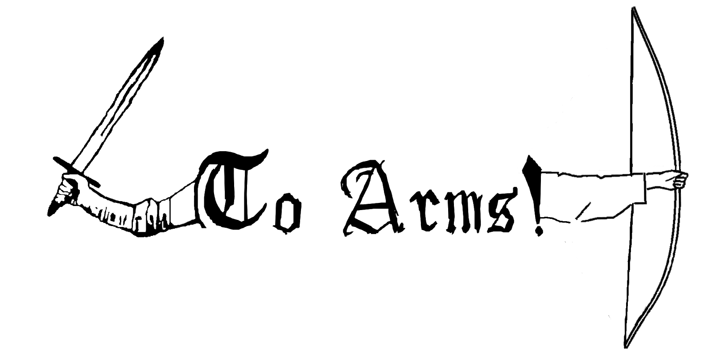
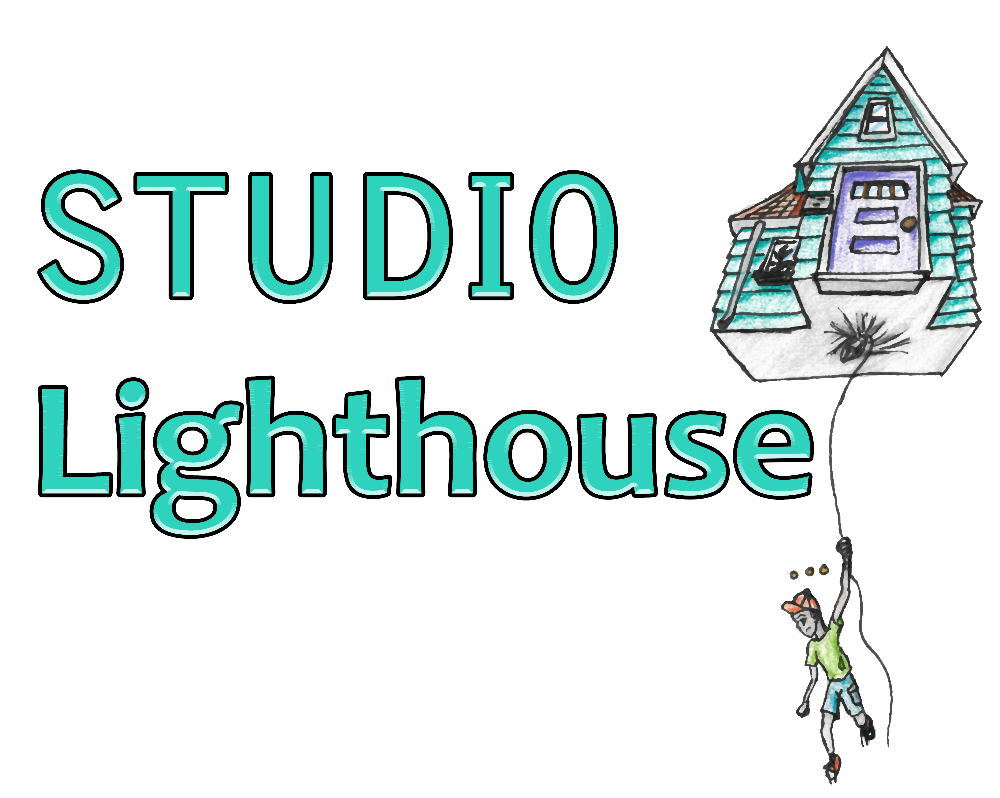

# Castle VR

A game for Windows Mixed Reality by Studio Lighthouse

## Packages Used
- https://assetstore.unity.com/packages/3d/characters/toony-tiny-ww1-soldiers-demo-115694
- https://jaks.itch.io/lowpolyforestpack
- https://assetstore.unity.com/packages/vfx/particles/cartoon-fx-free-109565
- https://assetstore.unity.com/packages/3d/environments/generic-low-poly-pack-141077
- https://assetstore.unity.com/packages/3d/props/furniture/big-furniture-pack-7717
- https://assetstore.unity.com/packages/3d/props/furniture/free-furniture-set-26678
- https://assetstore.unity.com/packages/vfx/shaders/free-skybox-cubemap-extended-107400

## Assets from Itch.io
- https://jprinsloo.itch.io/free-low-poly-medieval-buildings-pack
- https://imersastudios.itch.io/furniture-pack-low-poly

## Google Poly assets
- https://poly.google.com/view/dRvd7q2nO-6
